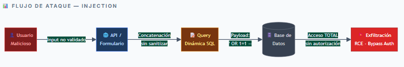
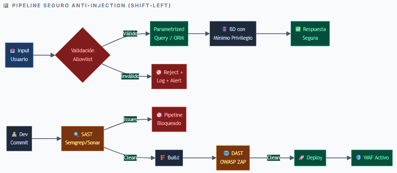
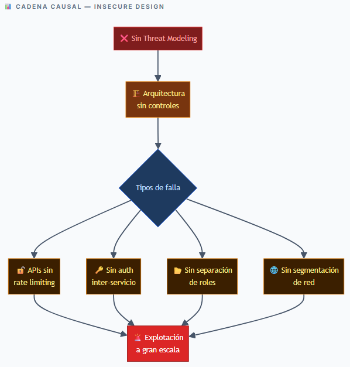
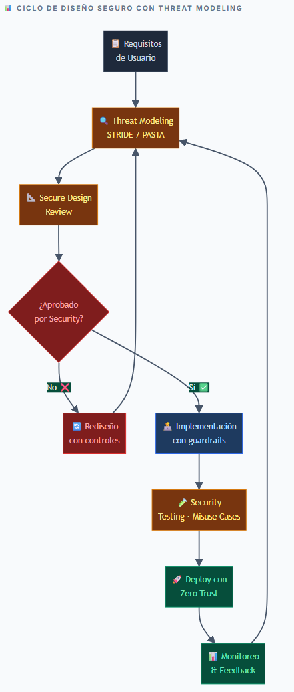
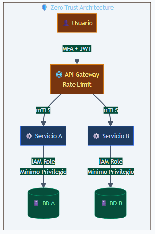
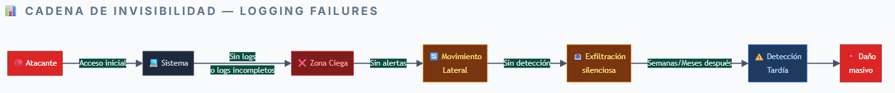
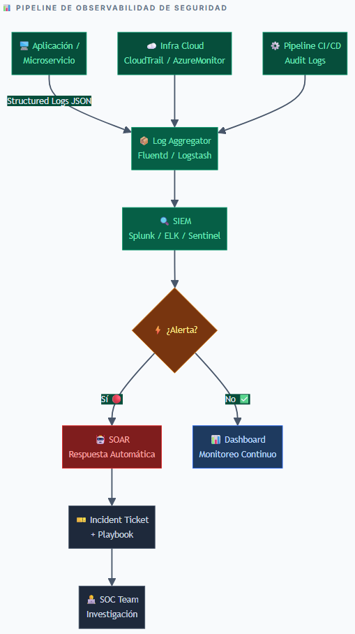

<table>
<colgroup>
<col style="width: 23%" />
<col style="width: 51%" />
<col style="width: 25%" />
</colgroup>
<thead>
<tr>
<th style="text-align: center;"><H1>A05</th>
<th>
<H1>Inyección

Ejecución de comandos maliciosos por datos no validados
</th>
<th style="text-align: center;"><H1>⚠ CRÍTICO</th>
</tr>
</thead>
<tbody>
</tbody>
</table>

## 📋 Descripción de la Vulnerabilidad

### 🎯 ¿Qué es?

Ocurre cuando datos no confiables son enviados a un intérprete como parte de un comando o consulta. El atacante puede engañar al interprete para que ejecute comandos no intencionados o acceda a datos sin autorización.

### ⚙️ ¿Cómo funciona?

El input del usuario se concatena directamente en queries SQL, comandos OS, LDAP o expresiones XPath sin sanitización. El payload malicioso manipula la lógica del interprete para ejecutar acciones no autorizadas.

### 🔥 Causas

- Falta de validación y sanitización de entradas de usuario

- Uso de consultas dinámicas concatenadas sin parametrización

- Dependencias desactualizadas con vulnerabilidades conocidas

- Ausencia del principio de mínimo privilegio en cuentas de BD

### 💥 Impacto

- Robo masivo y exfiltración de datos confidenciales

- Bypass de autenticación y autorización

- Remote Code Execution (RCE) — control total del servidor

- Escalamiento de privilegios y destrucción de información

### Tipos de Inyección

> *SQL Injection · NoSQL Injection (MongoDB \$where) · OS Command Injection · LDAP Injection · Server-Side Template Injection (SSTI) · Log4Shell (JNDI via strings de log)*

 

## ⚔️ Métodos de Explotación

### ¿Cómo la explotan los atacantes?

- Manipulación de parámetros HTTP, cabeceras y cookies

- Inputs en formularios de login, búsqueda o registro

- Inyección en APIs REST/GraphQL sin validación de entrada

- Variables de entorno en contenedores y scripts de IaC

### 🔴 Ejemplos Reales

<table style="width:67%;">
<colgroup>
<col style="width: 29%" />
<col style="width: 56%" />
</colgroup>
<thead>
<tr>
<th><h3 id="caso-año">Caso / Año</h3></th>
<th><h3 id="impacto-1">Impacto</h3></th>
</tr>
</thead>
<tbody>
<tr>
<td><h4 id="equifax-2017">Equifax (2017)</h3></td>
<td><h4 id="sqli-147m-registros-robados">SQLi → 147M registros robados</h3></td>
</tr>
<tr>
<td><h4 id="log4shell-2021">Log4Shell (2021)</h3></td>
<td><h4 id="jndi-injection-rce-masivo-en-infraestructura-cloud-global">JNDI injection → RCE masivo en infraestructura Cloud global</h3></td>
</tr>
<tr>
<td><h4 id="capital-one-2019">Capital One (2019)</h3></td>
<td><h4 id="ssrf-os-command-injection-en-aws-100m-clientes-expuestos">SSRF + OS Command Injection en AWS → 100M+ clientes expuestos</h3></td>
</tr>
<tr>
<td><h4 id="heartland-2008">Heartland (2008)</h3></td>
<td><h4 id="sql-injection-en-producción-130-millones-de-tarjetas-robadas">SQL Injection en producción → 130 millones de tarjetas robadas</h3></td>
</tr>
</tbody>
</table>

### 

### 🛠 Herramientas Comunes del Atacante

|  SQLMap   | Burp Suite | Metasploit | Havij  |
|:---------:|:----------:|:----------:|:------:|
| OWASP ZAP |  NoSQLMap  |   commix   | nuclei |

### Código Vulnerable vs. Seguro

> ' -- ❌ VULNERABLE: SQL Injection clásico query = "SELECT \* FROM users WHERE name='" + userInput + "'" -- Payload: ' OR '1'='1' -- -- Resultado: acceso a TODA la tabla //
>
> ❌ VULNERABLE: OS Command Injection exec("git clone " + repoUrl) // repoUrl = "repo; rm -rf /"

## 🛡️ Prevención y Mitigación

- Usar consultas parametrizadas / prepared statements en TODAS las operaciones de BD

- Implementar ORMs seguros (Hibernate, SQLAlchemy) que abstraigan la construcción de queries

- Validar y sanitizar todo input con allowlists estrictas (NUNCA blacklists)

- Aplicar principio de mínimo privilegio en cuentas de base de datos

- Integrar SAST/DAST en pipelines CI/CD (Semgrep, Checkmarx, SonarQube)

- Usar WAF con reglas anti-inyección en Cloud (AWS WAF, Cloudflare, ModSecurity)

## ✅ Buenas Prácticas DevSecOps

- Shift-Left Security: integrar pruebas de seguridad desde el primer commit

- Separar datos de comandos: nunca concatenar input del usuario en consultas

- Revisiones de código automáticas (SAST): bloquear Código vulnerable antes del merge

- Análisis de composición de software (SCA): detectar librerías con CVEs conocidas

- Escaneo de IaC: validar Terraform/CloudFormation con Checkov/tfsec

  

## ⚙️ Configuraciones Recomendadas

<table style="width:67%;">
<colgroup>
<col style="width: 29%" />
<col style="width: 56%" />
</colgroup>
<thead>
<tr>
<th><h3 id="área">Área</h2></th>
<th><h3 id="configuración">Configuración</h2></th>
</tr>
</thead>
<tbody>
<tr>
<td><h4 id="cicd-pipeline">CI/CD Pipeline</h2></td>
<td><h4 id="semgrep-con-ruleset-powasp-top-ten.-bloqueo-automático-ante-hallazgos-críticos">Semgrep con ruleset p/owasp-top-ten. Bloqueo automático ante hallazgos críticos</h2></td>
</tr>
<tr>
<td><h4 id="waf-cloud">WAF Cloud</h2></td>
<td><h4 id="aws-waf-con-awsmanagedrulescommonruleset-en-modo-prevention-activo">AWS WAF con AWSManagedRulesCommonRuleSet en modo Prevention activo</h2></td>
</tr>
<tr>
<td><h4 id="base-de-datos">Base de Datos</h2></td>
<td><h4 id="usuarios-con-permisos-mínimos.-disable-xp_cmdshell-en-mssql.-timeouts-de-consulta">Usuarios con permisos mínimos. Disable xp_cmdshell en MSSQL. Timeouts de consulta</h2></td>
</tr>
<tr>
<td><h4 id="secrets-manager">Secrets Manager</h2></td>
<td><h4 id="variables-sensibles-en-aws-secrets-manager-hashicorp-vault-nunca-hardcodeadas">Variables sensibles en AWS Secrets Manager / HashiCorp Vault, nunca hardcodeadas</h2></td>
</tr>
</tbody>
</table>

## 

## 🔒 Controles de Seguridad

<table style="width:67%;">
<colgroup>
<col style="width: 29%" />
<col style="width: 15%" />
<col style="width: 27%" />
<col style="width: 14%" />
</colgroup>
<thead>
<tr>
<th><h3 id="control">Control</h2></th>
<th><h3 id="tipo">Tipo</h2></th>
<th><h3 id="herramienta">Herramienta</h2></th>
<th><h3 id="prioridad">Prioridad</h2></th>
</tr>
</thead>
<tbody>
<tr>
<td><h4 id="prepared-statements-orm">Prepared Statements / ORM</h2></td>
<td><h4 id="preventivo">Preventivo</h2></td>
<td><h4 id="hibernate-sqlalchemy">Hibernate, SQLAlchemy</h2></td>
<td><h4 id="crítico">CRÍTICO</h2></td>
</tr>
<tr>
<td><h4 id="sast-en-pipeline-cicd">SAST en pipeline CI/CD</h2></td>
<td><h4 id="detectivo">Detectivo</h2></td>
<td><h4 id="semgrep-sonarqube">Semgrep, SonarQube</h2></td>
<td><h4 id="crítico-1">CRÍTICO</h2></td>
</tr>
<tr>
<td><h4 id="waf-con-reglas-owasp">WAF con reglas OWASP</h2></td>
<td><h4 id="preventivo-1">Preventivo</h2></td>
<td><h4 id="aws-waf-modsecurity">AWS WAF, ModSecurity</h2></td>
<td><h4 id="alto">ALTO</h2></td>
</tr>
<tr>
<td><h4 id="dast-en-staging">DAST en staging</h2></td>
<td><h4 id="detectivo-1">Detectivo</h2></td>
<td><h4 id="owasp-zap-burp-suite">OWASP ZAP, Burp Suite</h2></td>
<td><h4 id="alto-1">ALTO</h2></td>
</tr>
<tr>
<td><h4 id="input-validation-library">Input Validation Library</h2></td>
<td><h4 id="preventivo-2">Preventivo</h2></td>
<td><h4 id="esapi-validator.js">ESAPI, Validator.js</h2></td>
<td><h4 id="alto-2">ALTO</h2></td>
</tr>
<tr>
<td><h4 id="mínimo-privilegio-en-bd">Mínimo privilegio en BD</h2></td>
<td><h4 id="preventivo-3">Preventivo</h2></td>
<td><h4 id="iam-roles-db-users">IAM Roles, DB Users</h2></td>
<td><h4 id="medio">MEDIO</h2></td>
</tr>
</tbody>
</table>

## 

<table>
<colgroup>
<col style="width: 23%" />
<col style="width: 51%" />
<col style="width: 25%" />
</colgroup>
<thead>
<tr>
<th style="text-align: center;"><H1>A06</th>
<th>
<H1>Diseño Inseguro

Fallas estructurales de arquitectura desde el origen
</th>
<th style="text-align: center;"><H1>⚠ ALTO</th>
</tr>
</thead>
<tbody>
</tbody>
</table>

## 📋 Descripción de la Vulnerabilidad

### 🎯 ¿Qué es?

Falla estructural: la arquitectura del sistema no contempla amenazas ni requisitos de seguridad desde el inicio. A diferencia de otras vulnerabilidades, NO puede corregirse con una buena implementación: si el diseño es defectuoso, el sistema es inseguro por naturaleza.

### ⚙️ ¿Cómo funciona?

El atacante aprovecha flujos lógicos incorrectos, ausencia de controles de negocio o arquitecturas sin defensa en profundidad para ejecutar acciones no autorizadas SIN vulnerar técnicamente el sistema.

### 🔥 Causas

- Ausencia de Threat Modeling en la fase de diseño del producto

- Sin Security by Design ni Security by Default como principios base

- Requisitos de seguridad no definidos desde el inicio del proyecto

- Deuda técnica acumulada y falta de revisiones de arquitectura

### 💥 Impacto

- Vulnerabilidades sistémicas difíciles de corregir

- Bypass de lógica de negocio a gran escala

- Exposición masiva de datos

- Fraudes en plataformas Cloud con impacto financiero severo

## ⚔️ Métodos de Explotación

### Vectores de Ataque

- Business Logic Bypass: saltar pasos de un flujo de pago o aprobación

- Mass Assignment: modificar campos protegidos en APIs REST sin controles de atributo

- IDOR: acceder a recursos de otros usuarios manipulando IDs secuenciales

- Account Enumeration: fuerza bruta sin rate limiting ni bloqueo de cuenta

- Privilege Escalation: arquitectura sin separación efectiva de roles de usuario

### Ejemplos Reales

<table style="width:79%;">
<colgroup>
<col style="width: 15%" />
<col style="width: 63%" />
</colgroup>
<thead>
<tr>
<th><h3 id="caso-año-1">Caso / Año</h3></th>
<th><h3 id="falla-de-diseño-e-impacto">Falla de diseño e Impacto</h3></th>
</tr>
</thead>
<tbody>
<tr>
<td><h4 id="twitter-2020">Twitter (2020)</h3></td>
<td><h4 id="herramienta-interna-sin-controles-de-acceso-130-cuentas-vip-comprometidas">Herramienta interna sin controles de acceso → 130 cuentas VIP comprometidas</h3></td>
</tr>
<tr>
<td><h4 id="peloton-2021">Peloton (2021)</h3></td>
<td><h4 id="api-sin-autenticación-requerida-datos-de-millones-de-usuarios-expuestos">API sin autenticación requerida → datos de millones de usuarios expuestos</h3></td>
</tr>
<tr>
<td><h4 id="parler-2021">Parler (2021)</h3></td>
<td><h4 id="api-sin-rate-limit-ni-orden-de-recursos-scraping-de-70tb-de-datos">API sin rate limit ni orden de recursos → scraping de 70TB de datos</h3></td>
</tr>
<tr>
<td><h4 id="facebook-2018">Facebook (2018)</h3></td>
<td><h4 id="oauth-mal-diseñado-sin-validación-de-estado-50-millones-de-tokens-robados">OAuth mal diseñado sin validación de estado → 50 millones de tokens robados</h3></td>
</tr>
</tbody>
</table>

### 

## 🛡️ Prevención y Mitigación

- Integrar Threat Modeling (STRIDE, PASTA) en fases de diseño de cada sprint

- Definir Secure Design Patterns y arquitecturas de referencia documentadas

- Aplicar Defense in Depth: múltiples capas de controles independientes

- Implementar Zero Trust Architecture: nunca confiar, siempre verificar

- Realizar Design Review con checklist de seguridad antes de cada implementación

- Configurar rate limiting y cuotas en todas las APIs públicas e internas

## ✅ Buenas Prácticas DevSecOps

- Security by Design / Security by Default en todas las decisiones arquitectónicas

- Security Champions por equipo como responsables de revisiones de seguridad

- Threat Modeling obligatorio en cada sprint antes de comenzar la implementación

- ADRs (Architecture Decision Records) que incluyan consideraciones de seguridad

- Pruebas de abuso (misuse cases) definidas junto a los casos de uso funcionales

> **✅ Checklist Threat Modeling en Definition of Ready (DoR):**\
> · ☑ ¿Se identificaron activos y flujos de datos?
>
> · ☑ ¿Se aplicó STRIDE a cada componente?
>
> · ☑ ¿Existe autenticación inter-servicio (mTLS/JWT)?
>
> · ☑ ¿Rate limiting definido en APIs?
>
> · ☑ ¿Principio de mínimo privilegio en IAM roles?
>
> · ☑ ¿Segmentación de red (VPC/subnets) documentada?

## ⚙️ Configuraciones Recomendadas

<table style="width:96%;">
<colgroup>
<col style="width: 15%" />
<col style="width: 80%" />
</colgroup>
<thead>
<tr>
<th><h3 id="área-1">Área</h2></th>
<th><h3 id="configuración-1">Configuración</h2></th>
</tr>
</thead>
<tbody>
<tr>
<td><h4 id="api-gateway">API Gateway</h2></td>
<td><h4 id="rate-limiting-por-usuarioip.-cuotas-de-uso.-throttling-diferenciado.-aws-api-gw-kong">Rate limiting por usuario/IP. Cuotas de uso. Throttling diferenciado. AWS API GW / Kong</h2></td>
</tr>
<tr>
<td><h4 id="identity-access">Identity &amp; Access</h2></td>
<td><h4 id="mfa-obligatorio.-iam-granular-por-recurso.-roles-específicos-por-microservicio.-spiffespire">MFA obligatorio. IAM granular por recurso. Roles específicos por microservicio. SPIFFE/SPIRE</h2></td>
</tr>
<tr>
<td><h4 id="iac-seguro">IaC Seguro</h2></td>
<td><h4 id="checkovtfsec-en-cicd.-políticas-iam-con-acceso-mínimo.-feature-flags-con-controles-de-negocio">Checkov/tfsec en CI/CD. Políticas IAM con acceso mínimo. Feature flags con controles de negocio</h2></td>
</tr>
<tr>
<td><h4 id="zero-trust">Zero Trust</h2></td>
<td><h4 id="mtls-entre-microservicios.-jwt-con-expiración-corta.-verificación-continua-de-identidad-istio-envoy">mTLS entre microservicios. JWT con expiración corta. Verificación continua de identidad (Istio, Envoy)</h3></td>
</tr>
</tbody>
</table>

## 🔒 Controles de Seguridad

<table style="width:68%;">
<colgroup>
<col style="width: 22%" />
<col style="width: 13%" />
<col style="width: 23%" />
<col style="width: 8%" />
</colgroup>
<thead>
<tr>
<th><h3 id="control-1">Control</h2></th>
<th><h3 id="tipo-1">Tipo</h2></th>
<th><h3 id="herramienta-1">Herramienta</h2></th>
<th><h3 id="prioridad-1">Prioridad</h2></th>
</tr>
</thead>
<tbody>
<tr>
<td><h4 id="threat-modeling-en-sprint">Threat Modeling en sprint</h2></td>
<td><h4 id="diseño">Diseño</h2></td>
<td><h4 id="owasp-threat-dragon-stride">OWASP Threat Dragon, STRIDE</h2></td>
<td><h4 id="crítico-2">CRÍTICO</h2></td>
</tr>
<tr>
<td><h4 id="security-architecture-review">Security Architecture Review</h2></td>
<td><h4 id="diseño-1">Diseño</h2></td>
<td><h4 id="checklist-interno-adrs">Checklist interno, ADRs</h2></td>
<td><h4 id="crítico-3">CRÍTICO</h2></td>
</tr>
<tr>
<td><h4 id="zero-trust-mtls">Zero Trust + mTLS</h2></td>
<td><h4 id="implementación">Implementación</h2></td>
<td><h4 id="istio-envoy-spiffe">Istio, Envoy, SPIFFE</h2></td>
<td><h4 id="alto-3">ALTO</h2></td>
</tr>
<tr>
<td><h4 id="iac-security-scan">IaC Security Scan</h2></td>
<td><h4 id="cicd">CI/CD</h2></td>
<td><h4 id="checkov-tfsec-terrascan">Checkov, tfsec, terrascan</h2></td>
<td><h4 id="alto-4">ALTO</h2></td>
</tr>
<tr>
<td><h4 id="api-rate-limiting">API Rate Limiting</h2></td>
<td><h4 id="runtime">Runtime</h2></td>
<td><h4 id="aws-api-gw-kong-nginx">AWS API GW, Kong, Nginx</h2></td>
<td><h4 id="alto-5">ALTO</h2></td>
</tr>
<tr>
<td><h4 id="penetration-testing">Penetration Testing</h2></td>
<td><h4 id="pre-producción">Pre-producción</h2></td>
<td><h4 id="manual-dast-automatizado">Manual + DAST automatizado</h2></td>
<td><h4 id="medio-1">MEDIO</h2></td>
</tr>
</tbody>
</table>

## 

<table>
<colgroup>
<col style="width: 23%" />
<col style="width: 51%" />
<col style="width: 25%" />
</colgroup>
<thead>
<tr>
<th style="text-align: center;"><H1>A09</th>
<th>
<H1>Fallos de alertas y registros de seguridad

El silencio es la peor respuesta ante un ataque
</th>
<th style="text-align: center;"><H1>⚠ MEDIO-ALTO</th>
</tr>
</thead>
<tbody>
</tbody>
</table>

## 📋 Descripción de la Vulnerabilidad

### 🎯 ¿Qué es?

Ausencia o insuficiencia de logs de seguridad, monitoreo de eventos críticos y alertas ante comportamientos anómalos. Sin visibilidad, los atacantes pueden operar durante meses sin ser detectados.

### ⚙️ ¿Cómo funciona?

El atacante explota el sistema sin que se generen registros auditables ni alertas. Logs incompletos, no centralizados o sin monitoreo crean zonas ciegas que permiten la persistencia extendida en el entorno comprometido.

### 🔥 Causas

- Logs deshabilitados, incompletos o con granularidad insuficiente

- Sin integración con SIEM centralizado para correlación de eventos

- Alertas mal configuradas o ausentes ante eventos críticos

- Exceso de ruido vs señal: falsos positivos que enmascaran amenazas reales

- Ausencia de retención adecuada y protegida de logs (sin WORM)

### Impacto

> DATO CRÍTICO: El tiempo de permanencia promedio de un atacante no detectado es de 207 días (IBM Security Report). En SolarWinds fueron 9 meses de actividad invisible comprometiendo 18,000 organizaciones.

- MTTR (Mean Time To Respond) extremadamente elevado

- Brechas activas no detectadas durante semanas o meses

- Incumplimiento normativo: GDPR, PCI-DSS, ISO 27001, SOC 2

- Mayor daño financiero y reputacional acumulado por detección tardía

  

## ⚔️ Métodos de Explotación

### Técnicas de Evasión

- Log Tampering: eliminar o modificar logs post-intrusión para borrar rastros

- Log Flooding: generar ruido masivo para ocultar eventos reales entre miles de entradas falsas

- Slow & Low Attack: ataques lentos bajo el umbral de alertas configuradas

- Living off the Land: usar herramientas legítimas del sistema que no generan alertas

- Time-based Evasion: atacar en horarios de baja vigilancia (noches, feriados)

### Ejemplos Reales

<table style="width:79%;">
<colgroup>
<col style="width: 16%" />
<col style="width: 61%" />
</colgroup>
<thead>
<tr>
<th><h4 id="caso-año-2">Caso / Año</h3></th>
<th><h4 id="tiempo-sin-detección-e-impacto">Tiempo sin Detección e Impacto</h3></th>
</tr>
</thead>
<tbody>
<tr>
<td><h4 id="solarwinds-2020">SolarWinds (2020)</h3></td>
<td><h4 id="meses-sin-detección-18000-organizaciones-comprometidas-globalmente">9 meses sin detección → 18,000 organizaciones comprometidas globalmente</h3></td>
</tr>
<tr>
<td><h4 id="marriott-2018">Marriott (2018)</h3></td>
<td><h4 id="brecha-activa-4-años-500-millones-de-registros-de-huéspedes-expuestos">Brecha activa 4 años → 500 millones de registros de huéspedes expuestos</h3></td>
</tr>
<tr>
<td><h4 id="yahoo-2013-2016">Yahoo (2013-2016)</h3></td>
<td><h4 id="detectado-3-años-después-3000-millones-de-cuentas-afectadas">Detectado 3 años después → 3,000 millones de cuentas afectadas</h3></td>
</tr>
<tr>
<td><h4 id="uber-2016">Uber (2016)</h3></td>
<td><h4 id="brecha-oculta-1-año-sin-alertas-activas-datos-de-57m-usuarios">Brecha oculta 1 año sin alertas activas → datos de 57M usuarios</h3></td>
</tr>
</tbody>
</table>

### 

### Herramientas de Análisis Forense

| Splunk | ELK Stack | AWS CloudTrail |  Datadog  |
|:------:|:---------:|:--------------:|:---------:|
| Wazuh  |  Graylog  |    Grafana     | PagerDuty |

## 🛡️ Prevención y Mitigación

- Implementar logging centralizado con ELK Stack, Splunk o SIEM cloud-native

- Usar structured logging en JSON con niveles de severidad estándar

- Activar AWS CloudTrail, CloudWatch, GuardDuty en TODOS los entornos sin excepciones

- Definir alertas automáticas para: auth failures, privilege escalation, accesos anómalos

- Implementar retención de logs inmutable (S3 Object Lock WORM)

- Integrar SIEM con SOAR para respuesta automatizada a incidentes de seguridad

### CÓdigo — Structured Logging (Python)

> \# ✅ Structured Logging (Python) – Buena práctica import structlog log = structlog.get_logger() log.info("auth.login_attempt", user_id=user.id, ip_address=request.remote_addr, success=False, reason="invalid_password", timestamp=datetime.utcnow().isoformat() ) \# ❌ NUNCA loguear: passwords, tokens, PII en claro log.info("login", password=user_password) \# NUNCA hacer esto

## ✅ Buenas Prácticas DevSecOps

- Registrar eventos críticos: autenticaciones, errores de autorización, cambios de configuración

- Logs en formato JSON estructurado con campos estandarizados (timestamp, user_id, ip, action)

- Pruebas periódicas de alertas: simular incidentes para validar el pipeline de detección

- Integración con SOAR para playbooks de respuesta automatizada ante incidentes

- Sincronización NTP en todos los sistemas para correlación correcta de eventos

  

## ⚙️ Configuraciones Recomendadas

<table style="width:72%;">
<colgroup>
<col style="width: 18%" />
<col style="width: 73%" />
</colgroup>
<thead>
<tr>
<th><h3 id="servicio">Servicio</h2></th>
<th><h3 id="configuración-2">Configuración</h2></th>
</tr>
</thead>
<tbody>
<tr>
<td><h4 id="aws-cloudtrail">AWS CloudTrail</h2></td>
<td><h4 id="activar-en-todas-las-regiones.-logs-a-s3-con-object-lock-worm.-integrar-con-cloudwatch">Activar en todas las regiones. Logs a S3 con Object Lock (WORM). Integrar con CloudWatch</h2></td>
</tr>
<tr>
<td><h4 id="aws-guardduty">AWS GuardDuty</h2></td>
<td><h4 id="habilitar-threat-detection.-integrar-con-security-hub-para-correlación-centralizada">Habilitar threat detection. Integrar con Security Hub para correlación centralizada</h2></td>
</tr>
<tr>
<td><h4 id="alarmas-cloudwatch">Alarmas CloudWatch</h2></td>
<td><h4 id="alerta-inmediata-ante-uso-de-cuenta-root-threshold1-period300s-vía-sns">Alerta inmediata ante uso de cuenta root (threshold=1, period=300s) vÍa SNS</h2></td>
</tr>
<tr>
<td><h4 id="siem-soar">SIEM / SOAR</h2></td>
<td><h4 id="splunkelk-con-connectors-cloud.-playbooks-automáticos-ante-incidentes-críticos-detectados">Splunk/ELK con connectors cloud. Playbooks automáticos ante incidentes críticos detectados</h2></td>
</tr>
</tbody>
</table>

## 

## 🔒 Controles de Seguridad

<table style="width:62%;">
<colgroup>
<col style="width: 20%" />
<col style="width: 9%" />
<col style="width: 23%" />
<col style="width: 8%" />
</colgroup>
<thead>
<tr>
<th><h3 id="control-2">Control</h2></th>
<th><h3 id="tipo-2">Tipo</h2></th>
<th><h3 id="herramienta-2">Herramienta</h2></th>
<th><h3 id="prioridad-2">Prioridad</h2></th>
</tr>
</thead>
<tbody>
<tr>
<td><h4 id="siem-centralizado">SIEM centralizado</h2></td>
<td><h4 id="detectivo-2">Detectivo</h2></td>
<td><h4 id="splunk-elk-azure-sentinel">Splunk, ELK, Azure Sentinel</h2></td>
<td><h4 id="crítico-4">CRÍTICO</h2></td>
</tr>
<tr>
<td><h4 id="cloudtrail-guardduty">CloudTrail + GuardDuty</h2></td>
<td><h4 id="detectivo-3">Detectivo</h2></td>
<td><h4 id="aws-nativo-azure-defender">AWS nativo, Azure Defender</h2></td>
<td><h4 id="crítico-5">CRÍTICO</h2></td>
</tr>
<tr>
<td><h4 id="alertas-en-tiempo-real">Alertas en tiempo real</h2></td>
<td><h4 id="reactivo">Reactivo</h2></td>
<td><h4 id="pagerduty-opsgenie-sns">PagerDuty, OpsGenie, SNS</h2></td>
<td><h4 id="crítico-6">CRÍTICO</h2></td>
</tr>
<tr>
<td><h4 id="logs-inmutables-worm">Logs inmutables (WORM)</h2></td>
<td><h4 id="preventivo-4">Preventivo</h2></td>
<td><h4 id="s3-object-lock-azure-blob">S3 Object Lock, Azure Blob</h2></td>
<td><h4 id="alto-6">ALTO</h2></td>
</tr>
<tr>
<td><h4 id="soar-automatizado">SOAR automatizado</h2></td>
<td><h4 id="reactivo-1">Reactivo</h2></td>
<td><h4 id="splunk-soar-demistoxsoar">Splunk SOAR, Demisto/XSOAR</h2></td>
<td><h4 id="alto-7">ALTO</h2></td>
</tr>
<tr>
<td><h4 id="structured-logging">Structured Logging</h2></td>
<td><h4 id="preventivo-5">Preventivo</h2></td>
<td><h4 id="structlog-loguru-serilog">structlog, Loguru, Serilog</h2></td>
<td><h4 id="alto-8">ALTO</h2></td>
</tr>
<tr>
<td><h4 id="log-retention-policy">Log Retention Policy</h2></td>
<td><h4 id="preventivo-6">Preventivo</h2></td>
<td><h4 id="aws-config-rules-azure-policy">AWS Config Rules, Azure Policy</h2></td>
<td><h4 id="medio-2">MEDIO</h2></td>
</tr>
</tbody>
</table>

##